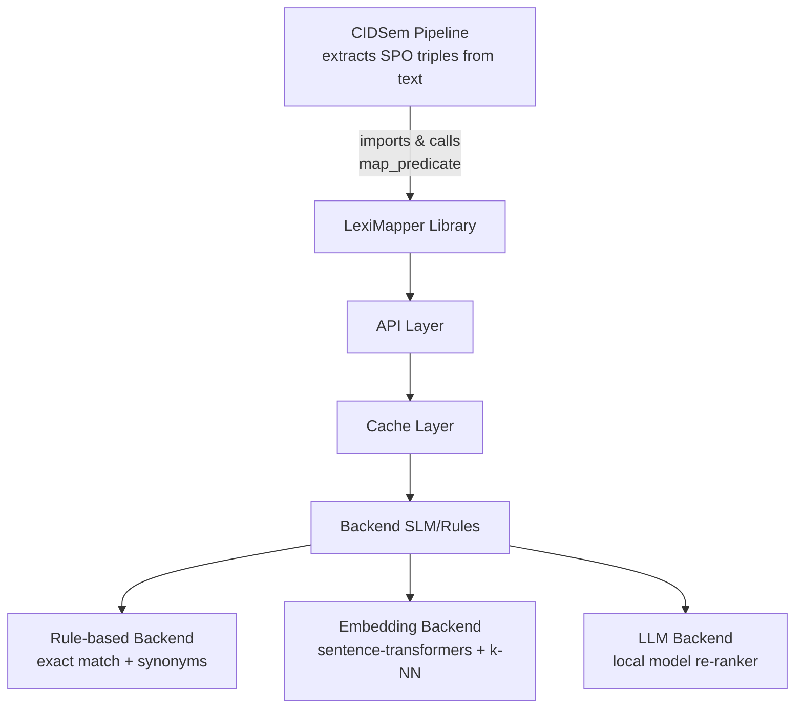
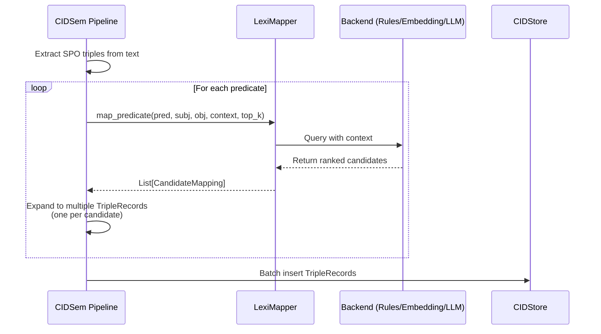

# LexiMapper Specification

**Version:** 1.0.0
**Status:** Draft
**Last Updated:** 2025-10-25

## Executive Summary

LexiMapper is a small language model (SLM) library designed to map natural-language predicates extracted from text to canonical ontology predicate identifiers. It provides multi-candidate rankings with confidence scores and optional explanations, enabling semantic triple extraction pipelines to handle ambiguous or context-dependent predicate mappings.

**Deployment model:** LexiMapper is a **Python library** that is imported directly into CIDSem (or other projects). Install via `pip install leximapper` and call `map_predicate()` in your code.

**Key capabilities:**
- Maps natural-language predicates (e.g., "joined", "works at") to ontology URIs (e.g., `R:sys:joined`, `R:sys:worksAt`)
- Returns top-k candidates with confidence scores (0.0–1.0)
- Supports context-aware mapping using subject, object, and surrounding text
- Provides optional human-readable explanations for mappings
- Deterministic fallback for offline/CI environments
- Response caching for performance

**Design goals:**
- Lightweight: runnable on CPU or small GPU
- Fast: <100ms p95 latency for typical queries
- Deterministic: reproducible results for CI/testing
- Extensible: pluggable backends (rule-based, embedding+kNN, LLM)

---

## 1. Architecture Overview

### 1.1 Components



### 1.2 Integration Flow



**Steps:**
1. **Extraction**: CIDSem's SPO extractor produces (subject, predicate, object) tuples from text
2. **Mapping**: Each predicate is sent to LexiMapper with context (subject, object, surrounding text)
3. **Ranking**: LexiMapper returns top-k candidate ontology predicates with scores
4. **Expansion**: Pipeline creates one TripleRecord per candidate, storing `candidate_index` and `candidate_score` in provenance
5. **Storage**: TripleRecords are batched and inserted into CIDStore

---

## 2. API Specification

### 2.1 Core Function: `map_predicate`

Maps a natural-language predicate to ontology predicate candidates.

```python
def map_predicate(
    predicate: str,
    subject: Optional[str] = None,
    object: Optional[str] = None,
    context: Optional[str] = None,
    top_k: int = 3,
    timeout_s: float = 1.0,
    backend: str = "auto"
) -> List[CandidateMapping]:
    """
    Map a natural-language predicate to ontology predicate candidates.

    Args:
        predicate: Natural language predicate string (e.g., "joined", "works at")
        subject: Optional subject entity for context (e.g., "alice")
        object: Optional object entity for context (e.g., "betacorp")
        context: Optional surrounding sentence/text for disambiguation
        top_k: Maximum number of candidates to return (default: 3)
        timeout_s: Maximum time to spend on mapping (default: 1.0s)
        backend: Backend to use: "auto", "rules", "embeddings", "llm"

    Returns:
        List of CandidateMapping objects, ordered by score (descending)
        Returns empty list on timeout or error (caller should use fallback)

    Raises:
        ValueError: If predicate is empty or top_k < 1
        TimeoutError: If mapping exceeds timeout_s (can be caught and handled)
    """
```

### 2.2 Data Structures

#### CandidateMapping

```python
@dataclass
class CandidateMapping:
    """A single candidate predicate mapping with metadata."""

    pred_id: str
    """Canonical ontology predicate identifier (e.g., 'R:sys:joined')"""

    score: float
    """Confidence score in range [0.0, 1.0], where 1.0 = highest confidence"""

    label: Optional[str] = None
    """Human-readable label for the predicate (e.g., 'joined organization')"""

    explanation: Optional[str] = None
    """Optional short explanation of why this mapping was chosen"""

    backend: str = "unknown"
    """Backend that produced this mapping: 'rules', 'embeddings', 'llm'"""

    latency_ms: Optional[float] = None
    """Time taken to produce this mapping in milliseconds"""
```

#### Example Response

```python
[
    CandidateMapping(
        pred_id="R:sys:joined",
        score=0.95,
        label="joined organization",
        explanation="Exact match for employment join event",
        backend="rules",
        latency_ms=0.8
    ),
    CandidateMapping(
        pred_id="R:sys:memberOf",
        score=0.72,
        label="member of",
        explanation="Similar concept: membership relationship",
        backend="embeddings",
        latency_ms=45.2
    ),
    CandidateMapping(
        pred_id="R:sys:affiliatedWith",
        score=0.58,
        label="affiliated with",
        explanation="Broader affiliation predicate",
        backend="embeddings",
        latency_ms=45.2
    )
]
```

### 2.3 Batch API

For efficiency when mapping multiple predicates:

```python
def map_predicates_batch(
    requests: List[MappingRequest],
    top_k: int = 3,
    timeout_s: float = 5.0,
    backend: str = "auto"
) -> List[List[CandidateMapping]]:
    """
    Map multiple predicates in a single batch request.

    Args:
        requests: List of MappingRequest objects
        top_k: Maximum candidates per predicate
        timeout_s: Total timeout for batch
        backend: Backend to use

    Returns:
        List of candidate lists, one per request (same order as input)
        Empty lists for failed/timeout requests
    """

@dataclass
class MappingRequest:
    predicate: str
    subject: Optional[str] = None
    object: Optional[str] = None
    context: Optional[str] = None
```

---

## 3. Backend Implementations

### 3.1 Rule-Based Backend

**Purpose:** Fast, deterministic fallback for known predicates

**Algorithm:**
1. Normalize input predicate (lowercase, strip, lemmatize)
2. Exact match against dictionary of known predicates → score 1.0
3. Substring/prefix match → score 0.8–0.9
4. Synonym lookup (small hand-curated table) → score 0.7–0.85
5. Return top-k sorted by score

**Advantages:**
- Zero latency (< 1ms)
- Deterministic (reproducible in CI)
- No dependencies

**Limitations:**
- Limited coverage (only known predicates)
- No semantic understanding

**Configuration:**
```yaml
rules:
  dictionary_path: "config/predicate_mappings.json"
  synonyms_path: "config/predicate_synonyms.json"
  case_sensitive: false
  min_score_threshold: 0.5
```

### 3.2 Embedding + k-NN Backend

**Purpose:** Semantic similarity for broader coverage

**Algorithm:**
1. Load pre-computed embeddings for all ontology predicates
2. Encode input predicate + context using sentence-transformers
3. Find k nearest neighbors in embedding space (cosine similarity)
4. Convert similarity → score (with calibration)
5. Return top-k candidates

**Model Options:**
- `all-MiniLM-L6-v2` (lightweight, 80MB, CPU-friendly)
- `all-mpnet-base-v2` (better quality, 420MB)
- Custom fine-tuned model (domain-specific)

**Advantages:**
- Semantic generalization
- Handles paraphrases and novel predicates
- Reasonable speed (10–50ms on CPU)

**Limitations:**
- Requires model download and embeddings file
- Less deterministic (model updates change results)
- May struggle with very short predicates

**Configuration:**
```yaml
embeddings:
  model_name: "all-MiniLM-L6-v2"
  embeddings_cache: "cache/ontology_embeddings.npy"
  similarity_metric: "cosine"
  min_similarity: 0.4
  calibration_alpha: 0.8  # scale similarity to [0,1]
```

### 3.3 LLM Re-ranker Backend (Optional)

**Purpose:** Highest quality mappings with explanations

**Algorithm:**
1. Use rules or embeddings to get initial top-10 candidates
2. Construct prompt with few-shot examples + context
3. Call local LLM (or API) to re-rank and explain
4. Parse structured output (JSON)
5. Return re-ranked top-k

**Model Options:**
- Local: Llama-3-8B, Mistral-7B, Phi-3-mini
- API: OpenAI, Anthropic (for experimentation)

**Advantages:**
- Best accuracy on ambiguous cases
- Natural language explanations
- Can use complex context

**Limitations:**
- Slower (100–500ms per query)
- Requires GPU or API access
- Less deterministic (temperature, sampling)

**Configuration:**
```yaml
llm:
  model_path: "models/llama-3-8b-instruct"
  temperature: 0.1
  max_tokens: 150
  prompt_template_path: "config/llm_prompt.txt"
  few_shot_examples: 6
```

---

## 4. Caching Strategy

### 4.1 Cache Key

```python
cache_key = sha256(
    predicate.lower().strip() + "|" +
    (subject or "").lower().strip() + "|" +
    (object or "").lower().strip() + "|" +
    (context or "")[:100]  # first 100 chars of context
).hexdigest()[:16]
```

### 4.2 Cache Storage

- **In-memory LRU cache**: 10,000 entries (default)
- **Persistent cache**: Optional SQLite or Redis backend
- **TTL**: 24 hours (configurable)

### 4.3 Cache Invalidation

- Manual: Clear cache on ontology updates
- Version-based: Include ontology version in cache key
- Time-based: TTL expiration

---

## 5. Performance Requirements

### 5.1 Latency Targets

| Backend      | p50      | p95       | p99       |
|--------------|----------|-----------|-----------|
| Rules        | < 1ms    | < 2ms     | < 5ms     |
| Embeddings   | < 30ms   | < 80ms    | < 150ms   |
| LLM          | < 200ms  | < 500ms   | < 1000ms  |

### 5.2 Throughput Targets

- Rules: > 10,000 calls/sec (single CPU core)
- Embeddings: > 100 calls/sec (CPU), > 1000 calls/sec (GPU)
- LLM: > 10 calls/sec (GPU), limited by model inference speed

### 5.3 Resource Requirements

**Minimal (rules only):**
- CPU: 1 core
- RAM: 100 MB
- Disk: 10 MB (dictionaries)

**Standard (rules + embeddings):**
- CPU: 2 cores
- RAM: 2 GB
- Disk: 500 MB (model + embeddings)

**Full (rules + embeddings + LLM):**
- CPU: 4 cores (or GPU)
- RAM: 8 GB (16 GB with GPU)
- Disk: 10 GB (model weights)
- GPU: Optional, 8GB VRAM (recommended for LLM)

---

## 6. Quality Metrics

### 6.1 Accuracy Metrics

- **Precision@1**: Top-1 candidate is correct
- **Precision@3**: Correct candidate in top-3
- **MRR (Mean Reciprocal Rank)**: Average 1/rank of correct answer
- **Coverage**: % of queries with at least one candidate returned

### 6.2 Calibration Metrics

- **ECE (Expected Calibration Error)**: How well scores reflect true confidence
- **Score distribution**: Should span [0, 1] with concentration at high confidence for correct mappings

### 6.3 Target Quality (on validation set)

| Metric        | Rules | Embeddings | LLM   |
|---------------|-------|------------|-------|
| Precision@1   | 0.85  | 0.90       | 0.95  |
| Precision@3   | 0.92  | 0.96       | 0.98  |
| Coverage      | 0.75  | 0.95       | 0.98  |
| ECE           | 0.05  | 0.08       | 0.06  |

---

## 7. Ontology Integration

### 7.1 Ontology Schema

LexiMapper expects ontology predicates to follow this schema:

```json
{
  "predicates": [
    {
      "id": "R:sys:joined",
      "label": "joined organization",
      "aliases": ["joined", "started at", "began working at"],
      "definition": "Subject became a member or employee of object organization",
      "domain": "Person",
      "range": "Organization",
      "examples": [
        {"subject": "alice", "predicate": "joined", "object": "betacorp"},
        {"subject": "john", "predicate": "started at", "object": "acme"}
      ]
    }
  ]
}
```

### 7.2 Ontology Updates

When the ontology is updated:
1. Regenerate embeddings for new/modified predicates
2. Update rule dictionaries and synonym tables
3. Clear or version-bump cache
4. Optionally: Re-run validation set and update metrics

---

## 8. Testing Strategy

### 8.1 Unit Tests

- **API contract tests**: Verify function signatures, types, error handling
- **Backend tests**: Each backend (rules, embeddings, LLM) tested independently
- **Cache tests**: Hit/miss behavior, eviction, TTL

### 8.2 Integration Tests

- **Pipeline integration**: Verify CIDSem can call LexiMapper and expand SPOs correctly
- **Multi-backend tests**: Fallback behavior when primary backend fails
- **Timeout tests**: Ensure graceful degradation on timeout

### 8.3 Validation Set

- **Source**: Hand-labeled examples from CIDSem fixtures and corpus
- **Size**: 200–500 examples covering common and edge-case predicates
- **Splits**: Train (for few-shot prompts), validation (for metrics), test (held-out)

### 8.4 Regression Tests

- **Deterministic suite**: Fixed seed, rules-only backend, expected outputs checked in CI
- **Performance benchmarks**: Latency regression tests (fail if p95 > 2x baseline)

---

## 9. Installation and Usage

### 9.1 Installation

**Install from PyPI (when published):**
```bash
pip install leximapper
```

**Install from git (development):**
```bash
pip install git+https://github.com/yourusername/leximapper.git
```

**Add to pyproject.toml:**
```toml
[tool.poetry.dependencies]
leximapper = "^1.0.0"
```

### 9.2 Basic Usage

**Simple function call (auto backend selection):**
```python
from leximapper import map_predicate, CandidateMapping

# Map a predicate with context
candidates = map_predicate(
    "joined",
    subject="alice",
    object="betacorp",
    top_k=3
)

for cand in candidates:
    print(f"{cand.pred_id} (score: {cand.score:.2f})")
```

**Configured mapper instance (for reuse):**
```python
from leximapper import LexiMapper

# Create mapper with specific backend and cache
mapper = LexiMapper(backend="embeddings", cache_size=5000)

# Reuse the same instance for multiple calls
candidates = mapper.map_predicate("joined", subject="alice", object="betacorp")
```

### 9.3 Integration with CIDSem

```python
from cidsem import process_text
from leximapper import map_predicate

# CIDSem will import LexiMapper internally
# Just install leximapper in the same environment

# Example: Process text and get SPO triples with ontology mapping
human_msgs, batch_request = process_text(
    "Alice joined BetaCorp in 2020.",
    use_llm=False  # Uses rule-based + LexiMapper
)
```

### 9.4 Batch Processing (CLI Utility)

**Use case:** Offline/bulk mapping

```bash
leximapper batch \
  --input predicates.jsonl \
  --output mappings.jsonl \
  --backend embeddings \
  --top-k 5
```

---

## 10. Configuration Reference

### 10.1 Config File Format (YAML)

```yaml
leximapper:
  version: "1.0"

  # Backend selection
  backend: "auto"  # auto, rules, embeddings, llm
  fallback_backends: ["rules"]  # try these if primary fails

  # API settings
  default_top_k: 3
  default_timeout_s: 1.0

  # Cache settings
  cache:
    type: "memory"  # memory, sqlite, redis
    max_size: 10000
    ttl_seconds: 86400

  # Rules backend
  rules:
    dictionary_path: "config/predicate_mappings.json"
    synonyms_path: "config/predicate_synonyms.json"
    min_score: 0.5

  # Embeddings backend
  embeddings:
    model_name: "all-MiniLM-L6-v2"
    embeddings_cache: "cache/ontology_embeddings.npy"
    device: "cpu"  # cpu, cuda, mps
    min_similarity: 0.4

  # LLM backend
  llm:
    model_path: "models/llama-3-8b-instruct"
    temperature: 0.1
    max_tokens: 150
    prompt_template: "config/llm_prompt.txt"

  # Logging
  logging:
    level: "INFO"
    format: "json"
    file: "logs/leximapper.log"
```

### 10.2 Environment Variables

```bash
LEXIMAPPER_CONFIG_PATH=config/leximapper.yaml
LEXIMAPPER_BACKEND=embeddings
LEXIMAPPER_CACHE_TYPE=redis
LEXIMAPPER_CACHE_URL=redis://localhost:6379
LEXIMAPPER_LOG_LEVEL=DEBUG
```

---

## 11. Error Handling

### 11.1 Error Types

```python
class LexiMapperError(Exception):
    """Base exception for LexiMapper errors"""

class TimeoutError(LexiMapperError):
    """Raised when mapping exceeds timeout"""

class BackendError(LexiMapperError):
    """Raised when backend fails (model load, inference error)"""

class InvalidInputError(LexiMapperError):
    """Raised for invalid input (empty predicate, negative top_k)"""
```

### 11.2 Error Recovery

- **Timeout**: Return empty list or partial results, log warning
- **Backend failure**: Try fallback backend, log error
- **Invalid input**: Raise `InvalidInputError` immediately
- **All backends fail**: Return empty list, log critical error

---

## 12. Observability

### 12.1 Metrics to Expose

LexiMapper provides instrumentation for monitoring library usage:

- `leximapper_calls_total` (counter): Total function calls by backend, status
- `leximapper_latency_seconds` (histogram): Call latency by backend
- `leximapper_cache_hits_total` (counter): Cache hits
- `leximapper_cache_misses_total` (counter): Cache misses
- `leximapper_backend_errors_total` (counter): Errors by backend
- `leximapper_candidates_returned` (histogram): Number of candidates returned per call

### 12.2 Logging

- Call logs (at DEBUG level): input predicate, top-k candidates, latency
- Error logs: Stack traces for backend failures
- Audit logs: All mappings (for quality analysis and debugging)

### 12.3 Tracing

Support OpenTelemetry tracing:
- Span for each `map_predicate` call
- Sub-spans for cache lookup, backend inference, scoring
- Integration with caller's trace context (when using OpenTelemetry in CIDSem)

---

## 13. Security Considerations

### 13.1 Input Validation

- Sanitize all string inputs (predicate, subject, object, context)
- Limit input lengths (prevent DoS via huge context strings)
- Validate `top_k` and `timeout_s` ranges

### 13.2 Resource Limits

- Per-request timeout enforcement
- Rate limiting (if deployed as service)
- Maximum cache size limits

### 13.3 Model Security

- Verify model checksums on load
- Use signed/trusted model sources
- Sandbox LLM execution if using external APIs

---

## 14. Development Roadmap

### Phase 1: MVP (Weeks 1–2)
- [ ] Create Python package structure (setup.py/pyproject.toml, src/leximapper/)
- [ ] Implement rule-based backend
- [ ] Implement core API (`map_predicate`, `LexiMapper` class)
- [ ] Add in-memory cache
- [ ] Write unit tests
- [ ] Publish to PyPI or make installable via git

### Phase 2: CIDSem Integration (Week 3)
- [ ] Add LexiMapper as dependency in CIDSem's pyproject.toml
- [ ] Update CIDSem's `mapper.py` to call LexiMapper
- [ ] Extend CIDSem pipeline to support multi-candidate expansion
- [ ] Add candidate_index and candidate_score to provenance
- [ ] Update CIDSem tests

### Phase 3: Embeddings Backend (Weeks 4–5)
- [ ] Implement embedding backend (sentence-transformers)
- [ ] Generate ontology embeddings
- [ ] Add calibration for similarity scores
- [ ] Benchmark latency and quality
- [ ] Write integration tests

### Phase 4: LLM Re-ranker (Weeks 6–7) - Optional
- [ ] Design prompt template and few-shot examples
- [ ] Implement LLM backend
- [ ] Fine-tune prompt for quality
- [ ] Add structured output parsing
- [ ] Evaluate on validation set

### Phase 5: Production Readiness (Week 8)
- [ ] Performance optimization
- [ ] Documentation and examples
- [ ] Optional: HTTP API for microservice deployment
- [ ] Optional: Persistent cache (Redis/SQLite)

### Phase 6: Continuous Improvement (Ongoing)
- [ ] Collect production mappings for analysis
- [ ] Retrain/fine-tune models with real data
- [ ] Expand ontology coverage
- [ ] Add domain-specific backends

---

## 15. Example Usage

### 15.1 Simple Mapping

```python
from leximapper import LexiMapper

mapper = LexiMapper()

# Map a single predicate
candidates = mapper.map_predicate(
    predicate="joined",
    subject="alice",
    object="betacorp",
    top_k=3
)

for i, candidate in enumerate(candidates):
    print(f"{i+1}. {candidate.pred_id} (score: {candidate.score:.2f})")
    print(f"   {candidate.explanation}")
```

Output:
```
1. R:sys:joined (score: 0.95)
   Exact match for employment join event
2. R:sys:memberOf (score: 0.72)
   Similar concept: membership relationship
3. R:sys:affiliatedWith (score: 0.58)
   Broader affiliation predicate
```

### 15.2 Integration with CIDSem

```python
from cidsem import process_text
from leximapper import LexiMapper

# Configure LexiMapper
mapper = LexiMapper(backend="embeddings", top_k=2)

# Process text (internally calls mapper)
text = "Alice joined BetaCorp in 2018."
human_msgs, batch_request = process_text(
    text,
    use_llm=False,
    mapper=mapper  # pass custom mapper
)

# batch_request now contains multiple TripleRecords per SPO
# (one per candidate predicate)
```

### 15.3 Batch Processing

```python
from leximapper import LexiMapper, MappingRequest

mapper = LexiMapper(backend="embeddings")

requests = [
    MappingRequest(predicate="joined", subject="alice", object="betacorp"),
    MappingRequest(predicate="works at", subject="bob", object="acme"),
    MappingRequest(predicate="left", subject="carol", object="techcorp")
]

results = mapper.map_predicates_batch(requests, top_k=3)

for req, candidates in zip(requests, results):
    print(f"\n{req.predicate}:")
    for c in candidates:
        print(f"  {c.pred_id} ({c.score:.2f})")
```

---

## 16. API Reference Summary

### Core Functions

| Function | Purpose | Input | Output |
|----------|---------|-------|--------|
| `map_predicate()` | Map single predicate | predicate, context, top_k | List[CandidateMapping] |
| `map_predicates_batch()` | Map multiple predicates | List[MappingRequest], top_k | List[List[CandidateMapping]] |
| `LexiMapper.__init__()` | Initialize mapper | backend, config | LexiMapper instance |
| `LexiMapper.warmup()` | Preload models/cache | None | None |
| `LexiMapper.clear_cache()` | Clear mapping cache | None | None |

### Data Classes

| Class | Purpose | Key Fields |
|-------|---------|------------|
| `CandidateMapping` | Single mapping result | pred_id, score, label, explanation |
| `MappingRequest` | Batch request item | predicate, subject, object, context |
| `MapperConfig` | Configuration | backend, cache settings, model paths |

---

## 17. FAQ

**Q: Can LexiMapper run completely offline?**
A: Yes, use the rules backend or pre-download embedding models. LLM backend requires local model weights.

**Q: How do I add a new predicate to the ontology?**
A: Update the ontology JSON, regenerate embeddings, update rule dictionaries, clear cache.

**Q: What happens if no candidates are found?**
A: Returns empty list. Caller should handle gracefully (e.g., skip triple or use generic predicate).

**Q: Can I use my own LLM?**
A: Yes, implement the `LLMBackend` interface with your model's inference code.

**Q: How do I improve mapping quality?**
A: Add more examples to rule dictionaries, fine-tune embedding model on domain data, or use larger LLM.

**Q: Is there a hosted version?**
A: Not yet. You can deploy the HTTP service yourself or use the embedded library.

---

## 18. References and Resources

### Related Specifications
- [CIDSem Specification](../specs/spec01-intro.md)
- [CIDStore Interface](cidstore%20interface.md)
- [Ontology Schema](../docs/spec/ontology.json)

### External Resources
- [Sentence Transformers Documentation](https://www.sbert.net/)
- [Hugging Face Transformers](https://huggingface.co/docs/transformers)
- [OpenTelemetry Python](https://opentelemetry.io/docs/instrumentation/python/)

### Papers and Articles
- "Sentence-BERT: Sentence Embeddings using Siamese BERT-Networks" (Reimers & Gurevych, 2019)
- "Semantic Similarity in Ontology Alignment" (various)

---

## 19. Changelog

| Version | Date       | Changes |
|---------|------------|---------|
| 1.0.0   | 2025-10-25 | Initial draft specification |

---

## 20. Contact and Contribution

**Project Repository:** (TBD - to be created as separate repo)
**Issue Tracker:** (TBD)
**Maintainer:** CIDSem Team

**Contributing:**
- Fork repository and submit pull requests
- Follow coding standards (PEP 8, type hints)
- Include unit tests for new features
- Update this spec for API changes

---

**End of Specification**
