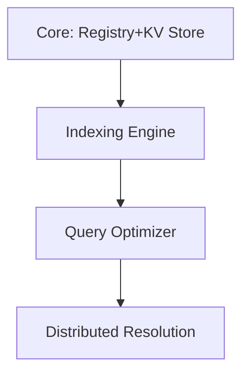

# 11. Final Word

CIDSEM delivers a uniform, high-performance semantic substrate where all entities—content, metadata, and schemas—are content-addressed, verifiable, and computable by their CIDs. This architecture solves the bootstrap problem through a carefully designed meta-schema and leverages modern hardware capabilities for ontological reasoning at scale.

## 📋 Summary Table

| Principle/Component      | Description/Specification                                 | CID Handling/Benefit                  |
|-------------------------|----------------------------------------------------------|---------------------------------------|
| Content Addressability  | All entities are CIDs (xxhash.xxh128)                     | Deterministic, verifiable, deduped    |
| Schema-First            | Schemas define binary layout, are first-class CIDs        | Zero-deserialization, direct access   |
| Performance-Centric     | SIMD, memory-mapped, schema-specific indexing             | 10-100x speedup, hardware offload     |
| Meta-Schema             | Pre-seeded, fixed, hardcoded CID                          | Bootstraps all schema logic           |
| Data Records            | Binary blobs, schema-driven                               | CID = hash(schema_cid + binary_data)  |
| Triples                 | (subject_cid, predicate_cid, object_cid)                  | CID = hash(subject|predicate|object)  |
| Hybrid Indexing         | Global (SPO/POS/OPS), schema-local (B-tree, Trie, GPU)    | Fast range, text, and graph queries   |
| Evolution               | Multiple schema versions, JIT converters, progressive idx  | Coexistence, hot/cold tiering         |
| Future-Proofing         | Quantum-resistant, FPGA, cross-cluster sync               | Resilient, scalable                   |

## 🗺️ Architecture Overview (Mermaid)

```mermaid
flowchart TD
    A[Meta-Schema (fixed CID)] --> B[Schemas (CIDs)]
    B --> C[Data Records (CIDs)]
    C --> D[Triples (CIDs)]
    D --> E[Indexes: SPO, POS, OPS, B-tree, Trie, GPU]
    E --> F[Query/Reasoning Layer]
    F --> G[Distributed Resolution]
```

## 🔍 Discovery Protocol (Mermaid)


## 🚀 Implementation Roadmap (Mermaid)



## ✅ Final Specification Checklist

| Checklist Item                                 | Status |
|------------------------------------------------|--------|
| Content addressability for all entities        |   ✔    |
| Pre-seeded meta-schema with known CID          |   ✔    |
| Binary canonicalization for schemas/data       |   ✔    |
| Schema-specific vectorized processing          |   ✔    |
| Lazy materialization with direct access        |   ✔    |
| Hybrid indexing strategy                       |   ✔    |
| Network-aware schema resolution                |   ✔    |

---

This condensed architecture delivers unprecedented performance while maintaining pure content addressability, enabling scalable, distributed reasoning at the speed of structured data.
 
## Pilot next steps & mapping to proposed changes

This repo's `spec00`..`spec08` are the canonical implementation-spec for pilots. `spec98` and `spec99` are reference appendices containing detailed proposals and should be used for deeper design rationale.

Immediate next steps (actionable):
- Implement pilot for `t:joined` and `t:worksAt` using the Validation Loop described in `spec06` and `validation_decision_pseudocode.md`.
- Deploy a micro-LLM fallback, bot service (Barkeep), and a simple Validation Worker in staging.
- Validate end-to-end with a 200–500 message gold dataset and iterate on thresholds.

Mapping to spec98/spec99:
- `spec99` defines the full component architecture used here (Preprocessor, Symbolic Extractor, Micro-LLM, Backlog, Dreaming, Predicate Registry, CID Mapper/Inserter).
- `spec98` provides the detailed Validation Layer design (bot personas, decisioning, data models) which this canonical spec has incorporated and distilled into machine-readable schemas and pseudocode.

When the pilot is stable, expand predicate coverage, automate predicate registry workflows, and schedule weekly retraining on labeled events.
