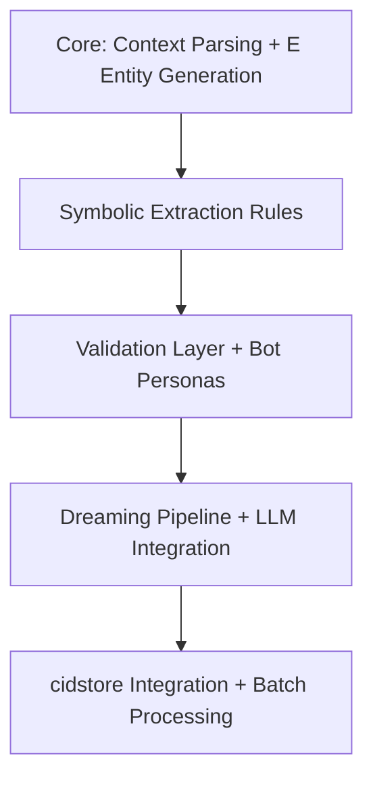

# 11. Final Word

CIDSEM delivers a deterministic, stateless context-to-triple extraction system that transforms arbitrary input contexts into (subject: E, predicate: E, object: E) triples suitable for direct storage in cidstore. This architecture enables semantic extraction at scale while maintaining compatibility with cidstore's 128-bit entity model and WAL-backed persistence.

## 📋 Summary Table

| Principle/Component      | Description/Specification                                 | E Entity Handling/Benefit             |
|-------------------------|----------------------------------------------------------|---------------------------------------|
| Content Addressability  | All entities are 128-bit E (cidstore.E format)           | Deterministic, verifiable, cidstore-compatible |
| Context-to-Triple       | Transforms arbitrary contexts to (E, E, E) triples       | Direct cidstore integration           |
| Deterministic Extraction| Same context produces same E entities and triples        | Idempotent, reproducible results      |
| Validation Layer        | Human/bot mediation for ambiguous extractions            | Prevents noisy auto-insertion         |
| Dual Extraction Paths   | Real-time symbolic + batch LLM dreaming                  | Fast + comprehensive coverage         |
| Predicate Registry      | Versioned ontology with E entity predicates              | Consistent semantic interpretation    |
| Provenance Tracking     | Meta-triples link results to source contexts             | Full auditability via cidstore       |
| Batch Processing        | Dreaming pipeline for complex/ambiguous contexts         | Scalable LLM-based extraction         |
| cidstore Integration    | Native E entity format, WAL-backed persistence           | Leverages cidstore capabilities       |

## 🗺️ Architecture Overview (Mermaid)

```mermaid
flowchart TD
    A[Input Contexts] --> B[cidsem Extraction]
    B --> C[Symbolic Extractor]
    B --> D[Micro-LLM Fallback]
    C --> E[(subject: E, predicate: E, object: E)]
    D --> F[Validation Layer]
    F --> E
    F --> G[Dreaming Pipeline]
    G --> E
    E --> H[cidstore.insert(key: E, value: E)]
    H --> I[cidstore WAL + HDF5]
```

##  Implementation Roadmap (Mermaid)



## ✅ Final Specification Checklist

| Checklist Item                                 | Status |
|------------------------------------------------|--------|
| 128-bit E entity compatibility with cidstore   |   ✔    |
| Deterministic context-to-triple extraction     |   ✔    |
| (subject: E, predicate: E, object: E) output   |   ✔    |
| cidstore.insert(key, value) integration        |   ✔    |
| Validation layer for ambiguous extractions     |   ✔    |
| Dual extraction paths (symbolic + dreaming)    |   ✔    |
| Provenance tracking via meta-triples           |   ✔    |
| Idempotent, stateless extraction logic         |   ✔    |

---

This condensed architecture delivers unprecedented performance while maintaining pure content addressability, enabling scalable, distributed reasoning at the speed of structured data.
 
## Pilot next steps & cidstore integration

This repo's `spec00`..`spec08` are the canonical implementation-spec for cidstore integration.

Immediate next steps (actionable):
- Implement core context-to-triple extraction using cidstore.E entity format
- Deploy symbolic extractor for structured contexts (JSON/dict -> triples)
- Implement cidstore.insert() integration for batch triple insertion
- Create pilot extraction rules for common context types (events, logs, documents)
- Validate end-to-end: context input -> E entity triples -> cidstore storage

Validation layer integration:
- Deploy micro-LLM fallback for ambiguous contexts
- Implement bot service (Barkeep) and Validation Worker using `validation_decision_pseudocode.md`
- Test with 200–500 context samples and iterate on extraction rules

cidstore integration requirements:
- All entities must use 128-bit E format (high/low 64-bit fields)
- Output (subject: E, predicate: E, object: E) triples ready for cidstore.insert(key, value)
- Leverage cidstore's WAL, multi-value support, and HDF5 backend
- Ensure deterministic, idempotent extraction (same context -> same triples)

When the pilot is stable, expand context type coverage, automate predicate registry workflows, and optimize batch processing for high-volume context streams.
